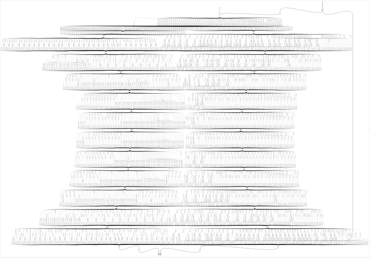

# Brent-Kung Adder (BKA)

A 64-bit Brent-Kung Adder implementing a parallel-prefix carry computation using an upsweep and downsweep prefix network.

## Features

- Parallel-prefix carry computation
- Reduced hardware compared to fully parallel prefix structures
- Synthesizable SystemVerilog
- RTL simulation and GLS verified
- Sky130 HD synthesis and OpenSTA STA

  
   
  BKA Synthesis

## Synthesis Results

**Technology:** Sky130 HD  
**Tool:** Yosys

| Metric | Value |
|---|---|
| Width | 64-bit |
| Area | 2058.224 µm² |

## Static Timing Analysis

| Metric | Value |
|---|---|
| Critical Path | 12.89 ns |
| Path | `b[0] → sum[63]` |
| Estimated Fmax | ~77.6 MHz |

## Power

| Metric | Value |
|---|---|
| Total Power | 1.02 mW |
