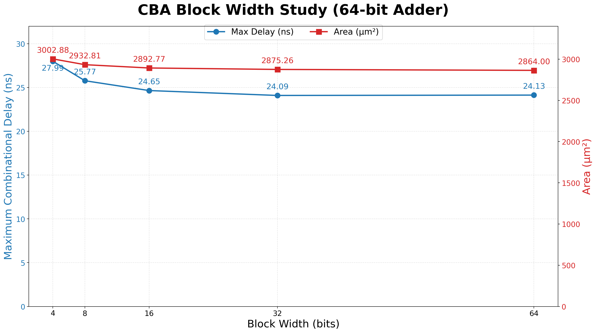

# Carry-Bypass Adder (CBA)

A parameterized 64-bit Carry-Bypass Adder using sixteen 4-bit blocks. Each block computes the carry using a Ripple-Carry Adder while a block-propagate signal enables the incoming carry to bypass the block when all four bit positions propagate carry, reducing carry propagation delay for favorable input patterns at the cost of additional hardware.

## Synthesis Results

**Technology:** Sky130 HD  
**Synthesis Tool:** Yosys

| Metric | Value |
|---|---|
| Width | 64-bit |
| Block Size | 32-bit |
| Number of Blocks | 2 |
| Area | 2875.2576 µm² |

## Static Timing Analysis (OpenSTA)

| Metric | Value |
|---|---|
| Maximum Combinational Delay | 24.09 ns |
| Estimated Fmax | ~41.5 MHz |

## Power Analysis

| Metric | Value |
|---|---|
| Total Power | 1.59 mW |

## Block Width Study

To determine a suitable block size for the 64-bit Carry-Bypass Adder, the design was synthesized and analyzed with different CBA block widths while preserving the hierarchical bypass structure.

The tested configurations were 4, 8, 16, 32, and 64-bit blocks.

### Experimental Results

**Timing Analysis:** OpenSTA  
**Adder Width:** 64-bit

| Block Width | Number of Blocks | Bypass MUXes | Area (µm²) | Max Delay (ns) | Est. Fmax |
|---|---|---|---|---|---|
| 4-bit | 16 | 16 | 3002.88 | 27.99 | ~35.7 MHz |
| 8-bit | 8 | 8 | 2932.81 | 25.77 | ~38.8 MHz |
| 16-bit | 4 | 4 | 2892.77 | 24.65 | ~40.6 MHz |
| **32-bit** | **2** | **2** | **2875.26** | **24.09** | **~41.5 MHz** |
| 64-bit | 1 | 1 | 2864.00 | 24.13 | ~41.4 MHz |

  
   
  Maximum combinational delay vs. CBA block width

### Observations

Increasing the block width progressively reduced both area and maximum combinational delay up to 32-bit blocks.

The reduction in delay became increasingly smaller as the block width increased:

- **4 → 8 bits:** 27.99 → 25.77 ns (**−2.22 ns**)
- **8 → 16 bits:** 25.77 → 24.65 ns (**−1.12 ns**)
- **16 → 32 bits:** 24.65 → 24.09 ns (**−0.56 ns**)
- **32 → 64 bits:** 24.09 → 24.13 ns (**+0.04 ns**)

Similarly, area reduction diminished with increasing block width. The 64-bit configuration provided only a small area reduction over the 32-bit configuration while being marginally slower.

At 64-bit block width, the design effectively becomes a single large ripple-carry block with a bypass MUX at its output. Consequently, the internal ripple path dominates the worst-case delay and the advantage of additional bypass structure largely disappears.

### Selected Configuration

Based on the synthesis and timing results, **32-bit blocks were selected for the final 64-bit CBA implementation**.

The 32-bit configuration achieved the lowest measured maximum delay of **24.09 ns** while maintaining the explicit carry-bypass structure. It also avoided the diminishing returns observed when increasing the block width to 64 bits.

For comparison, the corresponding 64-bit RCA implementation had a maximum delay of approximately **25.00 ns**. Thus, the selected CBA provides approximately:

**3.6% reduction in maximum combinational delay**

while demonstrating the architectural effect of carry bypass at the gate level.
