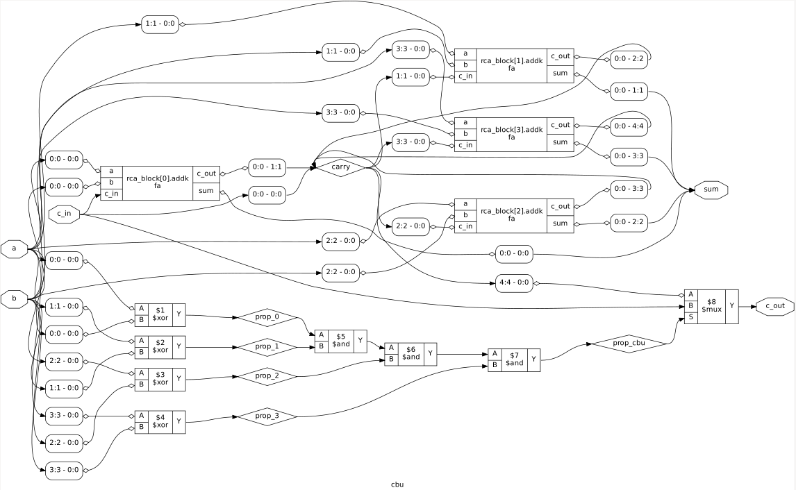

# Carry-Bypass Adder (CBA)

A parameterized 64-bit Carry-Bypass Adder using sixteen 4-bit blocks. Each block computes the carry using a Ripple-Carry Adder while a block-propagate signal enables the incoming carry to bypass the block when all four bit positions propagate carry, reducing carry propagation delay for favorable input patterns at the cost of additional hardware.

## Features

- Parameterized width
- 4-bit carry-bypass blocks at 64-bit configuration
- Sixteen 4-bit blocks
- Ripple-Carry Adder within each block
- Block-level carry bypass using propagate logic
- Reduced carry propagation for favorable input patterns

  
   
  Carry-Bypass Unit

## Synthesis Results

**Technology:** Sky130 HD  
**Synthesis Tool:** Yosys

| Metric | Value |
|---|---|
| Width | 64-bit |
| Block Size | 4-bit |
| Number of Blocks | 16 |
| Area | 3002.8800 µm² |

## Static Timing Analysis (OpenSTA)

| Metric | Value |
|---|---|
| Critical Path | 27.99 ns |
| Estimated Fmax | ~35.7 MHz |

## Power Analysis

| Metric | Value |
|---|---|
| Total Power | 1.59 mW |
