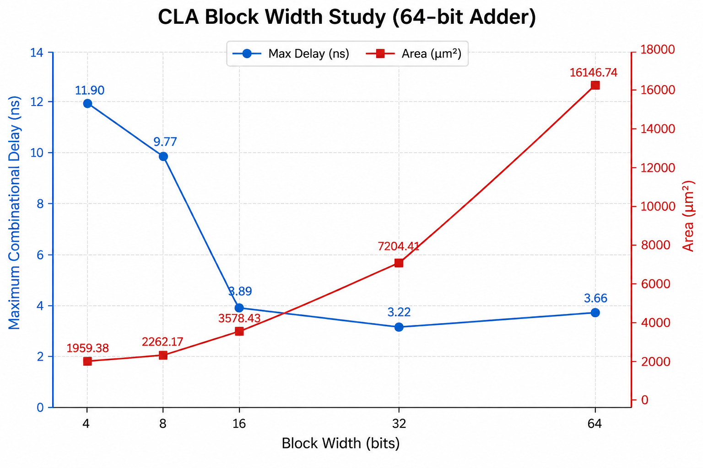

# Carry Lookahead Adder (CLA)
A parameterized 64-bit Carry Lookahead Adder using hierarchical lookahead blocks. Each block computes carry signals directly from propagate and generate terms, reducing the carry dependency compared to a Ripple-Carry Adder.

## Synthesis Results

**Technology:** Sky130 HD  
**Synthesis Tool:** Yosys

| Metric | Value |
|---|---|
| Width | 64-bit |
| Block Size | 32-bit |
| Number of Blocks | 2 |
| Area | 7204.4096 µm² |

## Static Timing Analysis (OpenSTA)

| Metric | Value |
|---|---|
| Maximum Combinational Delay | 3.22 ns |
| Estimated Fmax | ~310.6 MHz |

## Power Analysis
| Metric | Value | 
|---|---| 
| Total Power | 2.59 mW |

## Block Width Study

  
   
  Maximum combinational delay vs. CLA block width

To determine a suitable lookahead block size for the 64-bit Carry Lookahead Adder, the design was synthesized and analyzed with different CLA block widths while maintaining the same overall 64-bit adder architecture.

The tested configurations were 4, 8, 16, 32, and 64-bit lookahead blocks.

### Experimental Results

**Timing Analysis:** OpenSTA  
**Adder Width:** 64-bit

| Block Width | Number of Blocks | Area (µm²) | Max Delay (ns) | Est. Fmax |
|---|---|---|---|---|
| 4-bit | 16 | 1959.38 | 11.90 | ~84.0 MHz |
| 8-bit | 8 | 2262.17 | 9.77 | ~102.4 MHz |
| 16-bit | 4 | 3578.43 | 3.89 | ~257.1 MHz |
| **32-bit** | **2** | **7204.41** | **3.22** | **~310.6 MHz** |
| 64-bit | 1 | 16146.74 | 3.66 | ~273.2 MHz |

### Observations

Increasing the CLA block width significantly reduced the maximum combinational delay up to 32-bit blocks. However, the area increased rapidly as larger lookahead networks were constructed.

The timing improvements between configurations were:

- **4 → 8 bits:** 11.90 → 9.77 ns (**−2.13 ns, −17.9%**)
- **8 → 16 bits:** 9.77 → 3.89 ns (**−5.88 ns, −60.2%**)
- **16 → 32 bits:** 3.89 → 3.22 ns (**−0.67 ns, −17.2%**)
- **32 → 64 bits:** 3.22 → 3.66 ns (**+0.44 ns, +13.7%**)

While the 32-bit configuration achieved the lowest measured delay, increasing the block width to 64-bit caused the area to more than double:

**32-bit → 64-bit:**

- Area: 7204.41 → 16146.74 µm² (**~2.24×**)
- Delay: 3.22 → 3.66 ns (**13.7% worse**)
- Fmax: ~310.6 → ~273.2 MHz (**12.0% lower**)

This demonstrates the diminishing returns of increasing the lookahead range. A larger lookahead network reduces the logical carry dependency but introduces substantially more combinational hardware, routing, fanout, and complex gate structures. At 64-bit block width, these physical effects outweighed the theoretical reduction in carry dependency.

### Selected Configuration

Based on the synthesis and timing results, **32-bit blocks were selected for the final 64-bit CLA implementation**.

The 32-bit configuration achieved the **lowest measured maximum combinational delay of 3.22 ns**, corresponding to an estimated maximum frequency of approximately **310.6 MHz**.

Although the 32-bit configuration has significantly higher area than smaller CLA blocks, the design is being optimized primarily for **timing closure**. The 64-bit configuration demonstrated that further increasing the lookahead range does not necessarily improve physical timing and instead resulted in substantially higher area and worse measured delay.

For comparison, the corresponding 64-bit RCA implementation had a maximum delay of approximately **25.00 ns**. The selected 32-bit CLA therefore provides approximately:

**87.1% reduction in maximum combinational delay**

compared with the RCA implementation.

The study demonstrates the practical area-timing tradeoff of Carry Lookahead Adders and motivates the use of **hierarchical lookahead rather than a single extremely large flat lookahead network**.
