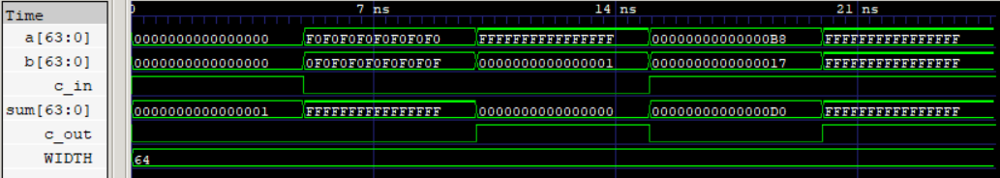

# Carry-Select Adder (CSA)

A parameterized 64-bit Carry-Select Adder using a 32+32-bit architecture. The upper half precomputes results for both possible carry-in values and selects the correct result based on the carry generated by the lower half, reducing carry propagation delay at the cost of additional hardware.

## Features

- Parameterized width
- 32+32-bit carry-select architecture at 64-bit configuration
- Reuses the structural Ripple-Carry Adder
- Parallel computation of upper-half carry-in cases
- Reduced carry propagation delay compared with RCA
- Synthesizable RTL
- Verified through RTL simulation and gate-level simulation

  
   
  64-Bit Addition

## Synthesis Results

**Technology:** Sky130 HD  
**Synthesis Tool:** Yosys

| Metric | Value |
|---|---|
| Width | 64-bit |
| Area | 2317.2224 µm² |

## Static Timing Analysis (OpenSTA)

| Metric | Value |
|---|---|
| Critical Path | 14.24 ns |
| Estimated Fmax | ~70.2 MHz |

## Power Analysis

**Operating Frequency:** 100 MHz

| Metric | Value |
|---|--- |
| Total Power | 1.25 mW |
