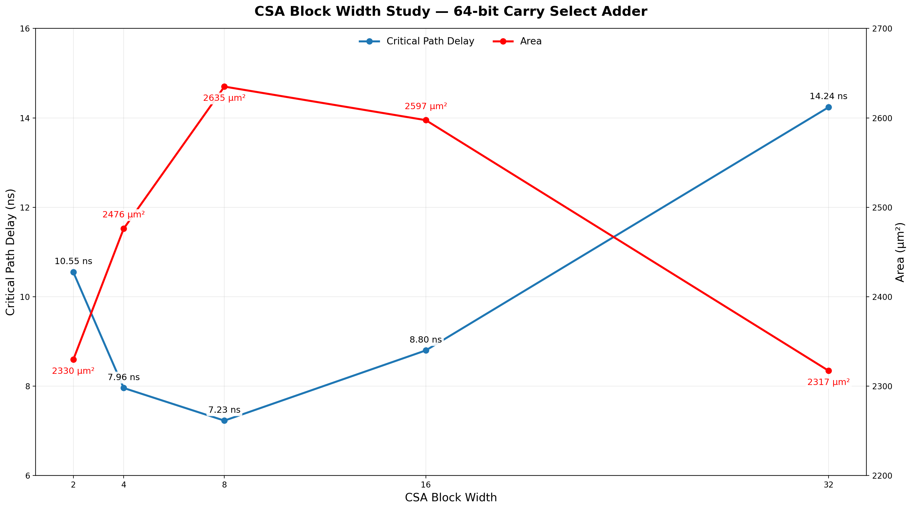

# Carry-Select Adder (CSA)

A parameterized 64-bit Carry-Select Adder using a 8*8-bit architecture. The upper half precomputes results for both possible carry-in values and selects the correct result based on the carry generated by the lower half, reducing carry propagation delay at the cost of additional hardware.

## Features

- Parameterized width
- 8*8-bit carry-select architecture at 64-bit configuration
- Reuses the structural Ripple-Carry Adder
- Parallel computation of upper-half carry-in cases
- Reduced carry propagation delay compared with RCA
- Synthesizable RTL
- Verified through RTL simulation and gate-level simulation

## Synthesis Results

**Technology:** Sky130 HD  
**Synthesis Tool:** Yosys

| Metric | Value |
|---|---|
| Width | 64-bit |
| Area | 2635.027200 µm² |

## Static Timing Analysis (OpenSTA)

| Metric | Value |
|---|---|
| Critical Path | 7.23 ns |
| Estimated Fmax | ~138.3 MHz |

## Power Analysis
| Metric | Value |
|---|--- |
| Total Power | 1.58 mW |

## Block Width Study

  
   
  Maximum combinational delay vs. Area vs. CSA block width

To determine a suitable block size for the 64-bit Carry Select Adder, the design was synthesized and analyzed with different CSA block widths while maintaining the same overall 64-bit adder architecture.
The tested configurations were 2, 4, 8, 16, 32, and 64-bit blocks.

### Experimental Results

**Timing Analysis:** OpenSTA  

| Block Width | Number of Blocks | Area (µm²) | Max Delay (ns) | Est. Fmax |
|---|---|---|---|---|
| 2-bit | 32 | 2329.73 | 10.55 | ~94.8 MHz |
| 4-bit | 16 | 2476.12 | 7.96 | ~125.6 MHz |
| **8-bit** | **8** | **2635.03** | **7.23** | **~138.3 MHz** |
| 16-bit | 4 | 2597.49 | 8.80 | ~113.6 MHz |
| 32-bit | 2 | 2317.22 | 14.24 | ~70.2 MHz |

### Observations

Reducing the CSA block width initially reduced the maximum combinational delay by shortening the ripple-carry paths inside each block. However, beyond a certain point, the increasing number of inter-block multiplexing stages became the dominant factor in the critical path.

The measured timing trend was:

- **32 → 16 bits:** 14.24 → 8.80 ns (**−5.44 ns, −38.2%**)
- **16 → 8 bits:** 8.80 → 7.23 ns (**−1.57 ns, −17.8%**)
- **8 → 4 bits:** 7.23 → 7.96 ns (**+0.73 ns, +10.1%**)
- **4 → 2 bits:** 7.96 → 10.55 ns (**+2.59 ns, +32.5%**)

The 8-bit configuration provides the lowest measured critical-path delay at 7.23 ns, corresponding to an estimated maximum frequency of approximately **138.3 MHz**.

- The results demonstrate that reducing the block width does not monotonically improve CSA timing. Smaller blocks reduce the delay of the speculative RCA computations, but also increase the number of sequential carry-selection stages.
- At 2-bit blocks, the individual RCA computations are very short, but the resulting 32-block architecture requires a long chain of carry-selection logic. The OpenSTA critical path contains repeated MUX and carry-selection logic, causing the total delay to increase substantially.

### Block Width Tradeoff

The behavior can be understood as a tradeoff between two competing delays:
Local computation delay:
Smaller blocks → shorter RCA → faster speculative computation.

Inter-block selection delay:
Smaller blocks → more blocks → longer MUX/carry-selection chain.

The 8-bit configuration represents the point where these effects are best balanced in the synthesized implementation.
The experimental results therefore show a clear optimum:

> **Making CSA blocks smaller improves timing only until the inter-block selection network becomes the dominant critical path.**

### PPA Tradeoff

The measured area also does not increase monotonically with the number of blocks. Synthesis and technology mapping produce different combinations of standard cells for each configuration, meaning that raw cell count does not directly correspond to physical area.

For the configurations where complete area-delay data was obtained:

| Block Width | Area (µm²) | Delay (ns) | ADP (µm²·ns) |
|---|---|---|---|
| 2-bit | 2329.73 | 10.55 | 24578.70 |
| 4-bit | 2476.12 | 7.96 | 19709.95 |
| **8-bit** | **2635.03** | **7.23** | **19051.25** |
| 16-bit | 2597.49 | 8.80 | 22857.92 |
| 32-bit | 2317.22 | 14.24 | 32978.04 |

The **8-bit configuration achieves the lowest measured ADP**, making it the best area-delay configuration among the tested designs.

Compared with 16-bit blocks:

- Area: 2597.49 → 2635.03 µm² (**~1.4% higher**)
- Delay: 8.80 → 7.23 ns (**~17.8% lower**)
- ADP: 22857.92 → 19051.25 µm²·ns (**~16.7% lower**)

Compared with 4-bit blocks:

- Area: 2476.12 → 2635.03 µm² (**~6.4% higher**)
- Delay: 7.96 → 7.23 ns (**~9.2% lower**)
- ADP: 19709.95 → 19051.25 µm²·ns (**~3.3% lower**)

Thus, the 8-bit configuration provides a particularly favorable balance between area and timing.

The sweep demonstrates an important architectural tradeoff in Carry Select Adders:

> **Larger blocks → longer local RCA delay but fewer selection stages**  
> **Smaller blocks → shorter local RCA delay but more selection stages**

For this Sky130HD implementation, the optimum occurs at **8-bit blocks**, where the benefits of parallel speculative computation are balanced against the delay of the inter-block MUX chain.
