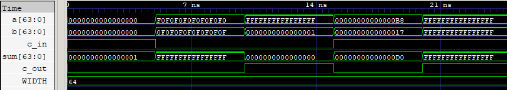

# Ripple-Carry Adder (RCA)

Parameterized 64-bit Ripple-Carry Adder built from cascaded full-adder stages.

## Features

- Parameterized width
- Default width: 64-bit
- Carry-in and carry-out
- Synthesizable SystemVerilog
- RTL simulation and GLS verified
- Sky130 HD synthesis and OpenSTA STA

  
   
  64-Bit Addition

## Synthesis Results

**Technology:** Sky130 HD  
**Tool:** Yosys

| Metric | Value |
|---|--- |
| Width | 64-bit |
| Area | 1761.6896 µm² |

## Static Timing Analysis

| Metric | Value |
|---|---:|
| Critical Path | 25.00 ns |
| Path | `c_in → c_out` |
| Estimated Fmax | ~40 MHz |

## Power

| Metric | Value |
|---|---:|
| Total Power | 925 µW |
